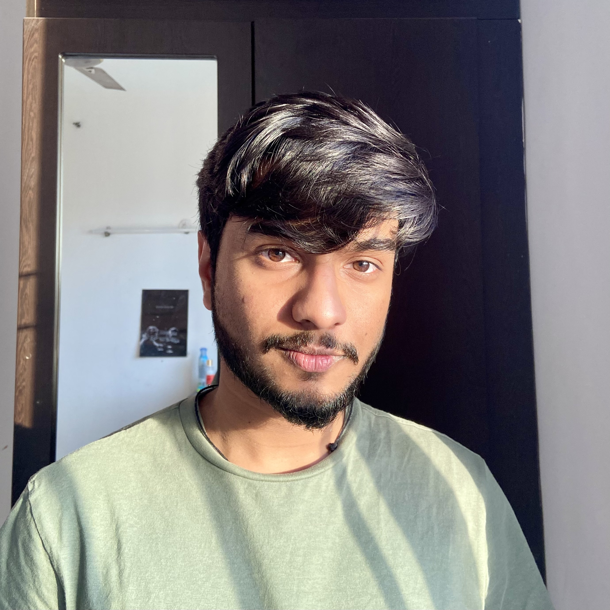

## About Me
<tr>
    <td> </td>
    <td>

		Msc @ Brown University  
        Visual Computing & AI 
		  
		<a href="mailto:aman_agarwal1@brown.edu">
			<i class="fa fa-envelope" aria-hidden="true"></i> aman_agarwal1@brown.edu</a>   
		<a href="https://github.com/aman190202">
			<i class="fa fa-github" aria-hidden="true"></i> Github </a>   
		<!-- <a href="https://scholar.google.com/citations?user=9ixpc8MAAAAJ&hl=en&oi=ao">
			<i class="fa fa-google" aria-hidden="true"></i> Google Scholar </a>    -->
		<a href="https://www.linkedin.com/in/aman190202/">
			<i class="fa fa-linkedin" aria-hidden="true"></i> LinkedIn </a>
             
			 
	
</td>
</tr>

I am an upcoming CS Grad at Brown, joining the program this Fall. My primary research interests are Computer Vision and Graphics, particulary in the emerging field of Inverse rendering via Neural Fields such as [NeRFs](https://www.matthewtancik.com/nerf) and [Gaussian Splatting](https://repo-sam.inria.fr/fungraph/3d-gaussian-splatting/).

## Experience



### {{ year.name }}	
---


<table class="paper-list">
  <tr>
  	
    <td></td>
	
	
    <td>
		

		<video width="80%" height="80%" muted autoplay loop>
			<source src="{{paper.paper-logo-mp4}}" type="video/mp4">
			Your browser does not support the video tag.
		</video>
		

	</td>
	
    <td>
		
{{jobs.title}}
  
		

			{{jobs.description}}
		

		
{{paper.paper-pub}}

		

			
			<a href="{{paper.link-pdf}}" target="_blank" rel="noopener">
				<i class="fa fa-file-pdf-o" aria-hidden="true"></i> PDF </a>
			

		

	</td>
  </tr>
</table>



<!-- ## Publications



### {{ year.name }}	
---


<table class="paper-list">
  <tr>
  	
    <td></td>
	
	
    <td>
		

		<video width="80%" height="80%" muted autoplay loop>
			<source src="{{paper.paper-logo-mp4}}" type="video/mp4">
			Your browser does not support the video tag.
		</video>
		

	</td>
	
    <td>
		
{{paper.paper-title}}
  
		

			
				
					{{author.name}}.
				
					{{author.name}},
				
			
		

		
{{paper.paper-pub}}

		

			
			<a href="{{paper.link-pdf}}" target="_blank" rel="noopener">
				<i class="fa fa-file-pdf-o" aria-hidden="true"></i> PDF </a>
			

		

	</td>
  </tr>
</table>

 -->

---
## Projects

<tr>
    <td>

        <a href="https://github.com/aman190202/LovingVincentt">
			<i class="fa fa-github" aria-hidden="true"></i> Loving Vincet:</a> Convert your videos into moving paintings of your choice
              
              
        <a href="https://github.com/aman190202/ray_tracing_weekend">
			<i class="fa fa-github" aria-hidden="true"></i>  Ray Tracer on MLX:</a> Implementing an entire Ray Tracer built from scratch in NumPy and modifying it to run on <a href="https://ml-explore.github.io/mlx/build/html/index.html">MLX</a>,a NumPy-like array framework designed for efficient and flexible machine learning on Apple silicon. [Ongoing]
             
			  
        <a href="https://devpost.com/software/rescue-shark">
			<i class="fa fa-github" aria-hidden="true"></i>  Rescue Shark:</a> Built a SOS application for Truck Drivers - Won a MLH Hackathon for "Most Creative Use of Twilio"
             
			  
	
</td>
</tr>

<!-- ---
## Invited talks

Date | Event | Details
-----|-------|--------
April, 24th 2024 | FMX 2024  | Survey on NeRFs and 3DGS for the Lighting & Rendering track organized by [Christophe Hery](https://www.linkedin.com/in/christophehery/) in Stuttgart, Germany. Thank you all for the great time there!
May, 6th 2024 | Machine Learning Coffee Seminar | Finnish Center for Artificial Intelligence (FCAI) [talk](https://fcai.fi/calendar/2024/5/6/juho-kannala-tba) on neural rendering. -->

---
 
 Template Credits : <a href="https://maturk.github.io">Matias Turkulainen</a>